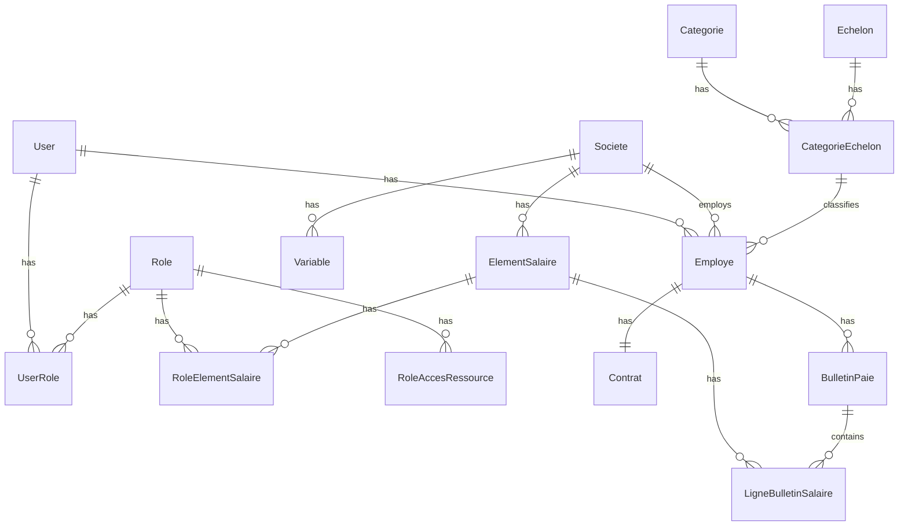

# Contexte Backend - Application de Paie

## Architecture Technique

### Stack Technologique
- **Framework Principal**: FastAPI (v0.112.2)
- **Base de Données**: MySQL avec SQLAlchemy (v1.4.43)
- **Migrations**: Alembic (v1.13.2)
- **Authentification**: JWT avec PyJWT et Authlib
- **Documentation**: Swagger UI et ReDoc intégrés
- **Tests**: Pytest
- **Déploiement**: Docker

### Structure du Projet
```
paie/
├── src/
│   ├── routers/         # Routes API par domaine fonctionnel
│   ├── middleware/      # Middlewares (logging, rate limiting, etc.)
│   ├── models.py        # Modèles SQLAlchemy
│   ├── schemas.py       # Schémas Pydantic
│   ├── database.py      # Configuration DB
│   ├── config.py        # Configuration application
│   ├── oauth2.py        # Gestion authentification
│   └── main.py          # Point d'entrée application
├── tests/
│   ├── integration/     # Tests d'intégration
│   └── unit/           # Tests unitaires
├── migrations/          # Scripts de migration Alembic
└── alembic.ini         # Configuration Alembic
```

## Fonctionnalités Principales

### 1. Gestion des Utilisateurs et Authentification
- Système de rôles et permissions
- Authentification JWT avec refresh tokens
- Rate limiting intégré
- Middleware de contrôle d'accès

### 2. Gestion de la Paie
- Gestion des employés
- Calcul des bulletins de paie
- Gestion des éléments de salaire
- Profils de paie
- Catégories et échelons

### 3. Sécurité et Performance
- Rate limiting configurable
- Logging des accès et actions
- Validation des données avec Pydantic
- Gestion des erreurs standardisée

## Configuration et Déploiement

### Variables d'Environnement Requises
```env
# Base de données
database_hostname=localhost
database_name=monapp_db
database_username=admin
database_password=S3cr3tP@ssword!

# JWT
token_secret_key=your_secret_key
token_algorithm=HS256
access_token_expire_minutes=15
refresh_token_expire_minutes=1440

# Rate Limiting
rate_limit_duration=60
rate_limit_requests=100
```

### Endpoints API Principaux

1. **Authentification**
   - POST `/login` - Authentification utilisateur
   - POST `/refresh` - Rafraîchissement token

2. **Employés**
   - GET `/employes` - Liste des employés
   - POST `/employes` - Création employé
   - GET `/employes/{id}` - Détails employé
   - PUT `/employes/{id}` - Mise à jour employé
   - DELETE `/employes/{id}` - Suppression employé

3. **Bulletins de Paie**
   - GET `/bulletins` - Liste des bulletins
   - POST `/bulletins/calcul` - Calcul bulletin
   - GET `/bulletins/{id}` - Détails bulletin

4. **Éléments de Salaire**
   - GET `/elements-salaire` - Liste des éléments
   - POST `/elements-salaire` - Création élément
   - PUT `/elements-salaire/{id}` - Mise à jour élément

### Modèles de Données Principaux

1. **Employé**
```python
class Employe(Base):
    id: int
    matricule: str
    nom: str
    prenom: str
    date_naissance: date
    lieu_naissance: str
    nationalite: str
    situation_familiale: str
    nombre_enfants: int
    adresse: str
    telephone: str
    email: str
    date_embauche: date
    categorie_id: int
    departement_id: int
    poste: str
    statut: str
```

2. **Bulletin de Paie**
```python
class BulletinPaie(Base):
    id: int
    employe_id: int
    periode: date
    date_calcul: datetime
    total_gains: float
    total_retenues: float
    net_a_payer: float
    statut: str
```

3. **Élément de Salaire**
```python
class ElementSalaire(Base):
    id: int
    code: str
    libelle: str
    type: str  # GAIN ou RETENUE
    methode_calcul: str  # FIXE, POURCENTAGE, FORMULE
    valeur: float
    formule: str
```

## Modèles de Données Détaillés

### Relations entre les Modèles



### Modèles Détaillés

1. **User et Authentification**
```python
class User(BasePaie):
    id: int
    pseudo: str
    name: str
    email: str
    phoneNumber: str
    password: str
    createOn: datetime
    isActive: bool
    
    # Relations
    employe: Employe
    role: List[UserRole]
```

2. **Gestion des Rôles et Permissions**
```python
class Role(BasePaie):
    id: int
    roleName: str
    
    # Relations
    roleElementSalaire: List[RoleElementSalaire]
    user: List[UserRole]
    ressourceAccesRole: List[RoleAccesRessource]

class RoleAccesRessource(BasePaie):
    id: int
    roleId: int
    ressourceId: int
    accessMode: str  # Format: "0000" pour CRUD
```

3. **Structure Organisationnelle**
```python
class Societe(BasePaie):
    id: int
    nom: str
    regime_fiscal: str
    localisation: str
    
    # Relations
    employe: List[Employe]
    variable: List[Variable]
    elementSalaire: List[ElementSalaire]

class Categorie(BasePaie):
    id: int
    libelle: str
    
    # Relations
    categorieEchelon: List[CategorieEchelon]

class Echelon(BasePaie):
    id: int
    libelle: str
    
    # Relations
    categorieEchelon: List[CategorieEchelon]
```

4. **Gestion des Employés**
```python
class Employe(BasePaie):
    id: int
    userId: int
    matricule: str
    nom: str
    statutFamilial: str
    nbEnfants: int
    nationalite: str
    estLoge: bool
    societeId: int
    categorieEchelonId: int
    
    # Relations
    user: User
    societe: Societe
    contrat: Contrat
    bulletinPaie: List[BulletinPaie]
```

5. **Gestion de la Paie**
```python
class ElementSalaire(BasePaie):
    id: int
    societeId: int
    libelle: str
    type_element: str
    nature: str
    imposable: bool
    soumisCnps: bool
    partEmploye: bool
    partEmployeur: bool
    prorataBase: int
    processCalculJson: JSON

class BulletinPaie(BasePaie):
    id: int
    employeId: int
    mois: int
    annee: int
    
    # Relations
    employe: Employe
    ligneBulletinSalaire: List[LigneBulletinSalaire]
```

## Schémas de Validation (Pydantic)

### Énumérations
```python
class RegimeFiscal(Enum):
    REEL = "reel"
    SIMPLIFIE = "simplifie"
    FORFAIT = "forfait"

class TypeContrat(Enum):
    cdi = "CDI"
    cdd = "CDD"

class TypeElement(Enum):
    prime = "prime"
    indemnite = "indemnite"
    retenue = "retenue"
    cotisation = "cotisation"
    avantage = "avantage"
```

### Schémas Principaux

1. **Authentification**
```python
class UserCreate(BaseModel):
    pseudo: str
    password: str
    roleId: Optional[List[int]] = None

class Token(BaseModel):
    access_token: str
    token_type: str
```

2. **Employé**
```python
class EmployeCreate(UserCreate, Employe):
    password: Optional[str] = None
    matricule: Optional[str] = None
    statutFamilial: Optional[str] = None
    nbEnfants: Optional[int] = None
    nationalite: Optional[str] = None
    estLoge: Optional[bool] = None
    societeId: int
    categorieEchelonId: int
```

3. **Paie**
```python
class ElementSalaire(BaseModel):
    societeId: int
    libelle: str
    type_element: TypeElement
    nature: NatureElement
    imposable: bool
    soumisCnps: bool
    partEmploye: bool
    partEmployeur: bool
    prorataBase: int = 30
    processCalculJson: Dict
```

## API Endpoints

### 1. Authentification (`/auth`)
- POST `/login` - Authentification
- POST `/refresh` - Rafraîchissement du token

### 2. Utilisateurs (`/users`)
- GET `/` - Liste des utilisateurs
- POST `/` - Création d'utilisateur
- GET `/{id}` - Détails utilisateur
- PUT `/{id}` - Modification utilisateur
- DELETE `/{id}` - Suppression utilisateur

### 3. Employés (`/employes`)
- GET `/` - Liste des employés
- POST `/` - Création d'employé
- GET `/{id}` - Détails employé
- PUT `/{id}` - Modification employé
- DELETE `/{id}` - Suppression employé

### 4. Paie (`/bulletins`)
- GET `/` - Liste des bulletins
- POST `/` - Création bulletin
- GET `/{id}` - Détails bulletin
- POST `/calcul` - Calcul bulletin
- GET `/employe/{id}` - Bulletins par employé

### 5. Éléments de Salaire (`/elements-salaire`)
- GET `/` - Liste des éléments
- POST `/` - Création élément
- GET `/{id}` - Détails élément
- PUT `/{id}` - Modification élément
- DELETE `/{id}` - Suppression élément

### 6. Société (`/societes`)
- GET `/` - Liste des sociétés
- POST `/` - Création société
- GET `/{id}` - Détails société
- PUT `/{id}` - Modification société
- DELETE `/{id}` - Suppression société

## Sécurité et Middleware

### 1. Rate Limiting
```python
RATE_LIMIT_DURATION = 60  # secondes
RATE_LIMIT_REQUESTS = 100  # requêtes
```

### 2. Contrôle d'Accès
```python
FREE_RESOURCES = ["/docs", "/redoc", "/login", "/openapi.json"]
```

### 3. Logging
- Journalisation des accès
- Journalisation des erreurs
- Journalisation des actions sensibles

## Configuration Base de Données

### Migration Alembic
```bash
# Création d'une migration
alembic revision --autogenerate -m "description"

# Application des migrations
alembic upgrade head
```

### Configuration SQLAlchemy
```python
SQLALCHEMY_DATABASE_URL = (
    f"mysql+pymysql://{settings.database_username}:"
    f"{settings.database_password}@{settings.database_hostname}/"
    f"{settings.database_name}"
)
```

## Tests

### Structure des Tests
```
tests/
├── integration/
│   └── test_access_control.py
└── unit/
    ├── test_auth.py
    ├── test_bulletin_paie.py
    ├── test_employe.py
    └── test_user.py
```

### Configuration des Tests
```python
@pytest.fixture
def test_user(client):
    user_data = {
        "pseudo": "testuser",
        "password": "password123"
    }
    res = client.post("/users/", json=user_data)
    assert res.status_code == 201
    new_user = res.json()
    new_user["password"] = user_data["password"]
    return new_user
```

## Tests et Qualité

### Structure des Tests
- Tests unitaires pour les services et utilitaires
- Tests d'intégration pour les endpoints API
- Tests de performance pour les calculs de paie

### Commandes Principales
```bash
# Lancer les tests
pytest

# Lancer les migrations
alembic upgrade head

# Démarrer l'application
uvicorn src.main:app --host 0.0.0.0 --port 80
```

## Notes de Déploiement

### Docker
- Image base Ubuntu 22.04
- Python 3.10
- Configuration timezone Africa/Douala
- Exposition port 80
- Virtualenv pour isolation

### Sécurité
- Rate limiting configuré
- Validation JWT
- Contrôle d'accès par rôle
- Logging des actions sensibles

## Points d'Attention

1. **Performance**
   - Optimisation des requêtes SQL
   - Mise en cache des calculs fréquents
   - Pagination des résultats

2. **Sécurité**
   - Validation des entrées
   - Gestion des permissions
   - Protection contre les injections

3. **Maintenance**
   - Logs structurés
   - Documentation à jour
   - Tests automatisés 

## Sécurité et Authentification Détaillée

### Configuration OAuth2
```python
# Configuration du Bearer Token
oauth2_scheme = OAuth2PasswordBearer(tokenUrl='login')

# Création du Token
def create_access_token(data: dict):
    to_encode = data.copy()
    expire = datetime.now(timezone.utc) + timedelta(minutes=settings.access_token_expire_minutes)
    to_encode.update({"exp": expire})
    return jwt.encode(to_encode, settings.token_secret_key, algorithm=settings.token_algorithm)

# Vérification du Token
def verify_access_token(token: str):
    try:
        payload = jwt.decode(token, settings.token_secret_key, algorithms=[settings.token_algorithm])
        if ("id" and "role") in payload:
            token_id: int = payload["id"]
            roles = payload["role"]
            return schemas.TokenData(id=token_id, roles=roles)
    except Exception as e:
        return JSONResponse(status_code=403, content={"message": f"{e}"})
```

### Gestion des Mots de Passe
```python
# Configuration du Hachage
pwd_context = CryptContext(schemes=["bcrypt"], deprecated="auto")

# Hachage du Mot de Passe
def hash(password: str):
    return pwd_context.hash(password)

# Vérification du Mot de Passe
def verify(plain_password, hashed_password):
    return pwd_context.verify(plain_password, hashed_password)
```

## Configuration Détaillée

### Variables d'Environnement
```python
class Settings(BaseSettings):
    # Base de données
    database_hostname: str
    database_password: str
    database_name: str
    database_username: str
    
    # Sécurité
    token_secret_key: str
    token_algorithm: str
    access_token_expire_minutes: int
    refresh_token_expire_minutes: int
    
    # Rate Limiting
    rate_limit_requests: int
    rate_limit_duration: int
    
    # Routes Publiques
    free_ressource: list
    
    # Tests
    test_headers: str
    test_base_url: str
    
    # Admin par Défaut
    admin_pseudo: str
    admin_password: str
    
    # Logging
    logging_file_path: str
```

## Utilitaires et Helpers

### Gestion des Réponses HTTP
```python
class CustomHttpResponse:
    @classmethod
    def object_not_found_404(cls):
        return JSONResponse(
            status_code=404,
            content={"message": "object is not found"}
        )

    @classmethod
    def object_exists_400(cls):
        return JSONResponse(
            status_code=400,
            content={"message": "this object exists"}
        )

    @classmethod
    def server_error_500(cls, e):
        return JSONResponse(
            status_code=500,
            content={"message": f"{e}"}
        )

    @classmethod
    def forbiden_ressource_403(cls):
        return JSONResponse(
            status_code=403,
            content={"message": "you don't have access to this ressource"}
        )
```

### Utilitaires de Données
```python
def sao_to_dic(obj):
    """Convertit un objet SQLAlchemy en dictionnaire"""
    dict_obj = {}
    for c in inspect(obj).mapper.column_attrs:
        if isinstance(getattr(obj, c.key), datetime):
            dict_obj[f"{c.key}"] = getattr(obj, c.key).isoformat()
        else:
            dict_obj[f"{c.key}"] = getattr(obj, c.key)
    return dict_obj

def remove_none_values(input_dict):
    """Supprime les valeurs None d'un dictionnaire"""
    return {k: v for k, v in input_dict.items() if v is not None}
```

## Gestion des Calculs de Paie

### Formules de Calcul
```python
class ProcessCalcul:
    def __init__(self, base: float, taux: float = None, montant: float = None):
        self.base = base
        self.taux = taux
        self.montant = montant

    def calcul_montant(self):
        if self.taux:
            return self.base * (self.taux / 100)
        return self.montant

class ElementSalaireCalcul:
    def __init__(self, element: ElementSalaire, employe: Employe):
        self.element = element
        self.employe = employe
        self.process = self.element.processCalculJson

    def execute(self):
        base = self.get_base()
        return ProcessCalcul(
            base=base,
            taux=self.process.get('taux'),
            montant=self.process.get('montant')
        ).calcul_montant()
```

### Règles de Gestion
```python
class ReglesPaie:
    # Plafonds CNPS
    PLAFOND_CNPS_RG = 750000
    PLAFOND_CNPS_RC = 750000
    PLAFOND_CNPS_PF = 750000

    # Taux de cotisation
    TAUX_CNPS_RG_EMPLOYEUR = 13.0
    TAUX_CNPS_RG_EMPLOYE = 4.2
    TAUX_CNPS_RC = 8.4
    TAUX_CNPS_PF = 7.0

    # Barème d'imposition
    BAREME_IRPP = [
        {"tranche": 0, "taux": 0},
        {"tranche": 62000, "taux": 10},
        {"tranche": 310000, "taux": 15},
        {"tranche": 475000, "taux": 25},
        {"tranche": 850000, "taux": 35},
        {"tranche": float('inf'), "taux": 40}
    ]
```

## Gestion des Erreurs

### Exceptions Personnalisées
```python
class PaieException(Exception):
    """Exception de base pour l'application"""
    pass

class ElementSalaireInvalideException(PaieException):
    """Élément de salaire invalide"""
    pass

class CalculPaieException(PaieException):
    """Erreur lors du calcul de la paie"""
    pass

class ValidationException(PaieException):
    """Erreur de validation des données"""
    pass
```

### Middleware de Gestion des Erreurs
```python
@app.exception_handler(PaieException)
async def paie_exception_handler(request: Request, exc: PaieException):
    return JSONResponse(
        status_code=400,
        content={"message": str(exc)}
    )

@app.exception_handler(ValidationException)
async def validation_exception_handler(request: Request, exc: ValidationException):
    return JSONResponse(
        status_code=422,
        content={"message": str(exc)}
    )
```

## Journalisation

### Configuration des Logs
```python
import logging
from logging.handlers import RotatingFileHandler

# Configuration du logger
logging.basicConfig(
    handlers=[RotatingFileHandler(
        filename=settings.logging_file_path,
        maxBytes=10000000,
        backupCount=5
    )],
    level=logging.INFO,
    format='%(asctime)s - %(name)s - %(levelname)s - %(message)s'
)

logger = logging.getLogger(__name__)
```

### Exemples de Logs
```python
# Log d'authentification
logger.info(f"Tentative de connexion utilisateur: {user.pseudo}")

# Log de calcul de paie
logger.info(f"Début calcul bulletin: Employé {employe.id}, Période {mois}/{annee}")

# Log d'erreur
logger.error(f"Erreur lors du calcul: {str(e)}", exc_info=True)
```

## Optimisations et Performance

### Cache
```python
from fastapi_cache import FastAPICache
from fastapi_cache.backends.redis import RedisBackend
from fastapi_cache.decorator import cache

@router.get("/elements-salaire/")
@cache(expire=3600)
async def get_elements():
    return db.query(ElementSalaire).all()
```

### Pagination
```python
from fastapi import Query

@router.get("/employes/")
async def get_employes(
    page: int = Query(1, ge=1),
    limit: int = Query(10, ge=1, le=100)
):
    skip = (page - 1) * limit
    total = db.query(Employe).count()
    employes = db.query(Employe).offset(skip).limit(limit).all()
    
    return {
        "total": total,
        "page": page,
        "limit": limit,
        "data": employes
    }
```

### Optimisation des Requêtes
```python
# Jointure optimisée
employes = (
    db.query(Employe)
    .options(
        joinedload(Employe.user),
        joinedload(Employe.contrat),
        joinedload(Employe.bulletinPaie)
    )
    .filter(Employe.societeId == societe_id)
    .all()
)

# Index sur les colonnes fréquemment utilisées
__table_args__ = (
    Index('idx_employe_societe', 'societeId'),
    Index('idx_bulletin_periode', 'mois', 'annee'),
) 