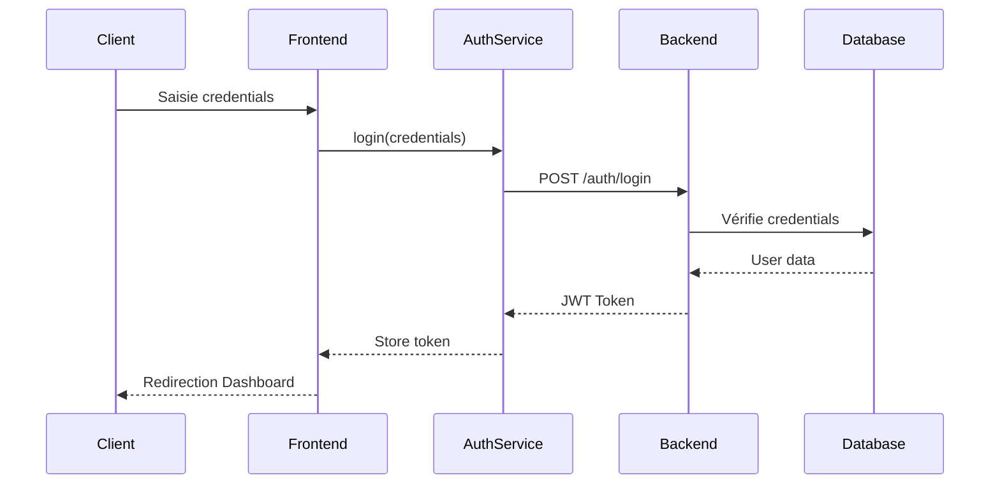

# Flux d'Authentification

Ce document décrit le processus d'authentification et de gestion des sessions dans l'application.

## 1. Architecture d'Authentification



## 2. Implémentation Backend

### JWT Configuration
```python
# src/oauth2.py
from jose import JWTError, jwt
from datetime import datetime, timedelta
from fastapi import Depends, HTTPException, status
from fastapi.security import OAuth2PasswordBearer

SECRET_KEY = "your-secret-key"
ALGORITHM = "HS256"
ACCESS_TOKEN_EXPIRE_MINUTES = 30

oauth2_scheme = OAuth2PasswordBearer(tokenUrl="auth/login")

def create_access_token(data: dict):
    to_encode = data.copy()
    expire = datetime.utcnow() + timedelta(minutes=ACCESS_TOKEN_EXPIRE_MINUTES)
    to_encode.update({"exp": expire})
    encoded_jwt = jwt.encode(to_encode, SECRET_KEY, algorithm=ALGORITHM)
    return encoded_jwt

def verify_token(token: str = Depends(oauth2_scheme)):
    credentials_exception = HTTPException(
        status_code=status.HTTP_401_UNAUTHORIZED,
        detail="Could not validate credentials",
        headers={"WWW-Authenticate": "Bearer"},
    )
    try:
        payload = jwt.decode(token, SECRET_KEY, algorithms=[ALGORITHM])
        user_id: str = payload.get("user_id")
        if user_id is None:
            raise credentials_exception
        return payload
    except JWTError:
        raise credentials_exception
```

### Routes d'Authentification
```python
# src/routers/auth.py
from fastapi import APIRouter, Depends, HTTPException, status
from sqlalchemy.orm import Session
from .. import schemas, models, oauth2
from ..database import get_db
from ..utils import verify_password

router = APIRouter(prefix="/auth", tags=["Authentication"])

@router.post("/login")
def login(credentials: schemas.UserLogin, db: Session = Depends(get_db)):
    user = db.query(models.User).filter(
        models.User.email == credentials.email
    ).first()
    
    if not user or not verify_password(credentials.password, user.password):
        raise HTTPException(
            status_code=status.HTTP_401_UNAUTHORIZED,
            detail="Incorrect email or password"
        )
        
    access_token = oauth2.create_access_token(
        data={"user_id": user.id}
    )
    
    return {
        "access_token": access_token,
        "token_type": "bearer"
    }

@router.post("/refresh-token")
def refresh_token(current_user: models.User = Depends(oauth2.get_current_user)):
    access_token = oauth2.create_access_token(
        data={"user_id": current_user.id}
    )
    return {
        "access_token": access_token,
        "token_type": "bearer"
    }
```

## 3. Implémentation Frontend

### Context d'Authentification
```typescript
// src/contexts/AuthContext.tsx
import { createContext, useContext, useState, useEffect } from 'react';
import { authService } from '@/services/authService';
import { User } from '@/types/auth';

interface AuthContextType {
  user: User | null;
  isAuthenticated: boolean;
  login: (credentials: LoginCredentials) => Promise<void>;
  logout: () => void;
  refreshToken: () => Promise<void>;
}

const AuthContext = createContext<AuthContextType | undefined>(undefined);

export const AuthProvider: React.FC = ({ children }) => {
  const [user, setUser] = useState<User | null>(null);
  const [isAuthenticated, setIsAuthenticated] = useState(false);

  useEffect(() => {
    const token = localStorage.getItem('token');
    if (token) {
      refreshToken();
    }
  }, []);

  const login = async (credentials: LoginCredentials) => {
    const { access_token, user } = await authService.login(credentials);
    localStorage.setItem('token', access_token);
    setUser(user);
    setIsAuthenticated(true);
  };

  const logout = () => {
    localStorage.removeItem('token');
    setUser(null);
    setIsAuthenticated(false);
  };

  const refreshToken = async () => {
    try {
      const { access_token, user } = await authService.refreshToken();
      localStorage.setItem('token', access_token);
      setUser(user);
      setIsAuthenticated(true);
    } catch (error) {
      logout();
    }
  };

  return (
    <AuthContext.Provider value={{
      user,
      isAuthenticated,
      login,
      logout,
      refreshToken
    }}>
      {children}
    </AuthContext.Provider>
  );
};
```

### Service d'Authentification
```typescript
// src/services/authService.ts
import api from './api';
import { LoginCredentials, AuthResponse, User } from '@/types/auth';

export const authService = {
  login: async (credentials: LoginCredentials) => {
    const response = await api.post<AuthResponse>('/auth/login', credentials);
    return response.data;
  },

  refreshToken: async () => {
    const response = await api.post<AuthResponse>('/auth/refresh-token');
    return response.data;
  },

  getCurrentUser: async () => {
    const response = await api.get<User>('/auth/me');
    return response.data;
  }
};
```

### Intercepteur Axios
```typescript
// src/services/api.ts
import axios from 'axios';

const api = axios.create({
  baseURL: import.meta.env.VITE_API_URL
});

// Request interceptor
api.interceptors.request.use(
  (config) => {
    const token = localStorage.getItem('token');
    if (token) {
      config.headers.Authorization = `Bearer ${token}`;
    }
    return config;
  },
  (error) => Promise.reject(error)
);

// Response interceptor
api.interceptors.response.use(
  (response) => response,
  async (error) => {
    const originalRequest = error.config;

    if (error.response?.status === 401 && !originalRequest._retry) {
      originalRequest._retry = true;

      try {
        const response = await authService.refreshToken();
        localStorage.setItem('token', response.access_token);
        
        originalRequest.headers.Authorization = 
          `Bearer ${response.access_token}`;
        
        return api(originalRequest);
      } catch (refreshError) {
        localStorage.removeItem('token');
        window.location.href = '/login';
        return Promise.reject(refreshError);
      }
    }

    return Promise.reject(error);
  }
);
```

## 4. Protection des Routes

### Backend
```python
# src/dependencies.py
from fastapi import Depends, HTTPException, status
from . import oauth2, models
from .database import get_db

async def get_current_user(
    token: str = Depends(oauth2.oauth2_scheme),
    db: Session = Depends(get_db)
):
    credentials_exception = HTTPException(
        status_code=status.HTTP_401_UNAUTHORIZED,
        detail="Could not validate credentials",
        headers={"WWW-Authenticate": "Bearer"},
    )
    
    payload = oauth2.verify_token(token)
    user = db.query(models.User).filter(
        models.User.id == payload.get("user_id")
    ).first()
    
    if user is None:
        raise credentials_exception
        
    return user

async def get_current_active_user(
    current_user: models.User = Depends(get_current_user)
):
    if not current_user.is_active:
        raise HTTPException(
            status_code=status.HTTP_400_BAD_REQUEST,
            detail="Inactive user"
        )
    return current_user
```

### Frontend
```typescript
// src/components/ProtectedRoute.tsx
import { Navigate, useLocation } from 'react-router-dom';
import { useAuth } from '@/contexts/AuthContext';

export const ProtectedRoute = ({ children }: { children: React.ReactNode }) => {
  const { isAuthenticated } = useAuth();
  const location = useLocation();

  if (!isAuthenticated) {
    return <Navigate to="/login" state={{ from: location }} replace />;
  }

  return <>{children}</>;
};

// App.tsx
const App = () => {
  return (
    <Router>
      <AuthProvider>
        <Routes>
          <Route path="/login" element={<LoginPage />} />
          
          <Route element={<ProtectedRoute />}>
            <Route path="/" element={<DashboardPage />} />
            <Route path="/employees" element={<EmployeesPage />} />
            {/* Autres routes protégées */}
          </Route>
        </Routes>
      </AuthProvider>
    </Router>
  );
};
```
