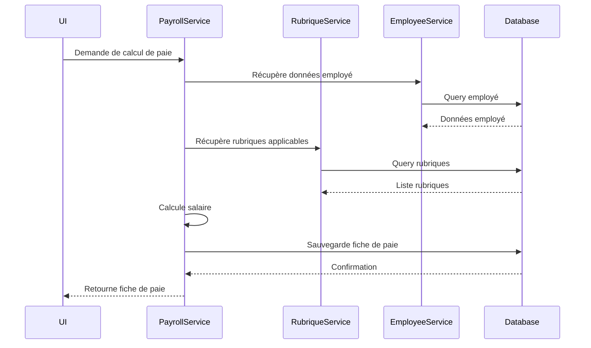
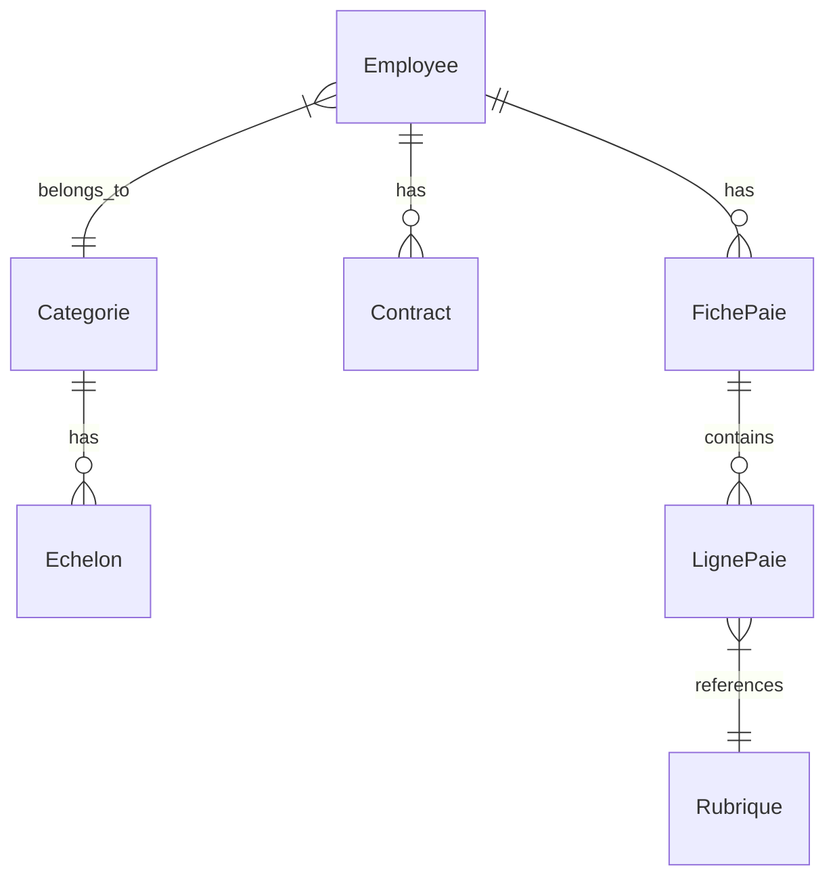

# Flux de Données

Ce document décrit les flux de données principaux dans l'application.

## 1. Flux de Calcul de Paie



## 2. Architecture des Données

### 2.1 Modèles de Base de Données


### 2.2 Flux de Données Frontend-Backend

```typescript
// Types Partagés
interface Employee {
  id: number;
  matricule: string;
  nom: string;
  prenom: string;
  date_embauche: string;
  categorie_id: number;
}

interface FichePaie {
  id: number;
  employee_id: number;
  periode: string;
  salaire_brut: number;
  total_retenues: number;
  salaire_net: number;
  lignes_paie: LignePaie[];
}

interface LignePaie {
  id: number;
  rubrique_id: number;
  base: number;
  taux: number;
  montant: number;
}
```

## 3. Processus Métier Principaux

### 3.1 Création d'un Employé

```typescript
// Frontend (src/pages/employees/CreateEmployee.tsx)
const CreateEmployee: React.FC = () => {
  const { createEmployee } = useEmployees();
  
  const handleSubmit = async (data: EmployeeCreate) => {
    try {
      await createEmployee(data);
      // Redirection ou notification
    } catch (error) {
      // Gestion d'erreur
    }
  };
  
  return (
    <EmployeeForm onSubmit={handleSubmit} />
  );
};

// Backend (src/services/employee_service.py)
async def create_employee(db: Session, employee: EmployeeCreate):
    db_employee = Employee(**employee.dict())
    db.add(db_employee)
    await db.commit()
    await db.refresh(db_employee)
    return db_employee
```

### 3.2 Calcul de Paie

```typescript
// Frontend (src/pages/payroll/GeneratePayslip.tsx)
const GeneratePayslip: React.FC = () => {
  const { generatePayslip } = usePayroll();
  
  const handleGenerate = async (params: PayslipParams) => {
    try {
      const payslip = await generatePayslip(params);
      // Affichage ou téléchargement
    } catch (error) {
      // Gestion d'erreur
    }
  };
  
  return (
    <PayslipForm onSubmit={handleGenerate} />
  );
};

// Backend (src/services/payroll_service.py)
async def generate_payslip(
    db: Session,
    employee_id: int,
    period: str
) -> FichePaie:
    # 1. Récupération des données
    employee = await get_employee(db, employee_id)
    rubriques = await get_applicable_rubriques(db, employee)
    
    # 2. Calcul du salaire de base
    base_salary = calculate_base_salary(employee)
    
    # 3. Application des rubriques
    payslip_lines = []
    total_deductions = 0
    
    for rubrique in rubriques:
        amount = calculate_rubrique_amount(
            rubrique,
            base_salary,
            employee
        )
        
        line = LignePaie(
            rubrique_id=rubrique.id,
            base=base_salary,
            taux=rubrique.taux,
            montant=amount
        )
        
        if rubrique.type == "deduction":
            total_deductions += amount
            
        payslip_lines.append(line)
    
    # 4. Création de la fiche de paie
    payslip = FichePaie(
        employee_id=employee_id,
        periode=period,
        salaire_brut=base_salary,
        total_retenues=total_deductions,
        salaire_net=base_salary - total_deductions,
        lignes_paie=payslip_lines
    )
    
    db.add(payslip)
    await db.commit()
    return payslip
```

## 4. Gestion des Erreurs et Validation

### 4.1 Validation Frontend

```typescript
// src/validations/employee.ts
import * as yup from 'yup';

export const employeeSchema = yup.object().shape({
  matricule: yup.string()
    .required("Le matricule est requis")
    .matches(/^[A-Z]{2}\d{4}$/, "Format invalide"),
  
  nom: yup.string()
    .required("Le nom est requis")
    .min(2, "Trop court"),
  
  prenom: yup.string()
    .required("Le prénom est requis")
    .min(2, "Trop court"),
  
  date_embauche: yup.date()
    .required("La date d'embauche est requise")
    .max(new Date(), "Date future invalide"),
  
  categorie_id: yup.number()
    .required("La catégorie est requise")
    .positive("Catégorie invalide")
});
```

### 4.2 Validation Backend

```python
# src/schemas.py
from pydantic import BaseModel, validator
from datetime import date

class EmployeeCreate(BaseModel):
    matricule: str
    nom: str
    prenom: str
    date_embauche: date
    categorie_id: int
    
    @validator('matricule')
    def validate_matricule(cls, v):
        if not re.match(r'^[A-Z]{2}\d{4}$', v):
            raise ValueError('Format de matricule invalide')
        return v
    
    @validator('date_embauche')
    def validate_date_embauche(cls, v):
        if v > date.today():
            raise ValueError('Date future invalide')
        return v
```

## 5. Gestion de l'État

### 5.1 État Global Frontend

```typescript
// src/store/payroll.ts
import create from 'zustand';

interface PayrollState {
  currentPayslip: FichePaie | null;
  isCalculating: boolean;
  error: string | null;
  
  setCurrentPayslip: (payslip: FichePaie) => void;
  clearCurrentPayslip: () => void;
  setCalculating: (status: boolean) => void;
  setError: (error: string | null) => void;
}

export const usePayrollStore = create<PayrollState>((set) => ({
  currentPayslip: null,
  isCalculating: false,
  error: null,
  
  setCurrentPayslip: (payslip) => set({ currentPayslip: payslip }),
  clearCurrentPayslip: () => set({ currentPayslip: null }),
  setCalculating: (status) => set({ isCalculating: status }),
  setError: (error) => set({ error })
}));
```

### 5.2 Gestion de Cache

```typescript
// src/services/queryClient.ts
import { QueryClient } from 'react-query';

export const queryClient = new QueryClient({
  defaultOptions: {
    queries: {
      staleTime: 5 * 60 * 1000, // 5 minutes
      cacheTime: 30 * 60 * 1000, // 30 minutes
      retry: 1,
      refetchOnWindowFocus: false,
    },
  },
});

// Exemple d'invalidation de cache
queryClient.invalidateQueries(['employees']);
queryClient.invalidateQueries(['payslips', employeeId]);
```

## 6. Sécurité des Données

### 6.1 Autorisation

```typescript
// Frontend
const canEditEmployee = (user: User, employee: Employee): boolean => {
  return user.role === 'admin' || user.role === 'hr_manager';
};

const canGeneratePayslip = (user: User): boolean => {
  return user.permissions.includes('generate_payslip');
};

// Backend
def verify_employee_access(
    db: Session,
    user: User,
    employee_id: int
) -> bool:
    if user.role in ['admin', 'hr_manager']:
        return True
        
    # Vérification spécifique pour les managers
    if user.role == 'manager':
        employee = db.query(Employee).get(employee_id)
        return employee.department_id == user.department_id
        
    return False
```

### 6.2 Validation des Données Sensibles

```typescript
// Frontend
const sanitizeEmployeeData = (data: EmployeeData): EmployeeData => {
  return {
    ...data,
    salary: Number(data.salary),
    socialSecurityNumber: data.socialSecurityNumber.replace(/\s/g, '')
  };
};

// Backend
def mask_sensitive_data(employee_data: dict) -> dict:
    if 'social_security_number' in employee_data:
        employee_data['social_security_number'] = '***-**-' + \
            employee_data['social_security_number'][-4:]
    return employee_data
```
